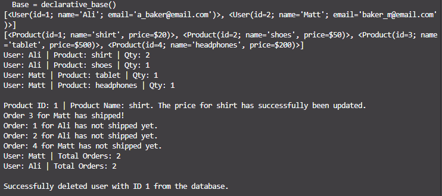

# SQLite Order Tracking System

A Python command-line application using SQLAlchemy 2.0 to manage users, products, and orders in a relational database.

---

## Features

- **Modern SQLAlchemy 2.0 ORM mapping with type hints**
- **Complete CRUD capabilities (Creating records, updating order statuses, and deleting users)**
- **Defensive edge-case handling for deleted or missing data**
- **Automated database resets on script execution for clean testing**

---

## Tech Stack

- **Python 3.x, SQLAlchemy, SQLite**

---

## Design Decisions & Edge Case Handling

- **Cascade Deletion:** Configured cascading relationships so that deleting a user safely cleans up associated orders, preventing database integrity crashes.
- **Defensive Queries:** Wrapped data updates and deletions in conditional checks (`if object:`) to handle missing records gracefully without throwing runtime errors.
- **Deterministic Testing Environment:** Implemented an automated table teardown (`drop_all`) at startup to ensure test data resets cleanly on every script execution.

## Installation & Setup

1. Clone the repository.
2. Install dependencies: `pip install SQLAlchemy`
3. Run the script: `python database.py`

---

##

()
